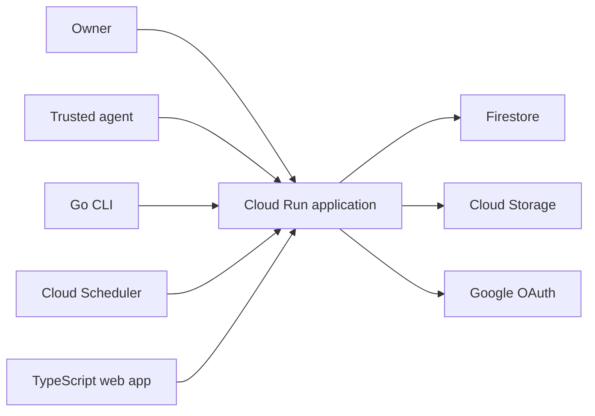

# ContentFlow MVP

> **Status:** Approved

## 1. Executive summary

ContentFlow is currently a browser-only UI prototype. It demonstrates the writing experience, but content disappears on reload and agents cannot work with it through a stable interface. The MVP will turn the prototype into a personal, short-lived content workspace with a Go API and CLI, a TypeScript web app, and file attachments.

The application will run on Google Cloud. Cloud Run will host the application, Firestore will store structured content, and Cloud Storage will store image, finished video, and PDF bytes. Content and assets stop being available 56 days after creation, while managed physical deletion follows asynchronously. This avoids an always-on database while keeping data durable during its useful life. The main downside is that Firestore has weaker constraints than PostgreSQL, so the Go service must enforce type and ordering rules.

## 2. Context and scope

The existing app stores example items in React state. It supports searching, status filters, format-specific editors, YouTube script blocks, attachment placeholders, and a simulated repurposing flow. It has no durable database, authentication, upload storage, API, CLI, conflict handling, or automatic expiry.

The MVP is a single-owner application. It must let the owner create, edit, search, and organise content across seven formats. It must also let trusted agents do the same work through an API or CLI. Content is working material, not a permanent archive. Every content item and uploaded asset remains available for no more than eight weeks from its creation. The API then hides it immediately and Google Cloud removes its stored data asynchronously.

AI generation stays outside the core application for the MVP. An agent may generate content, but it writes the result through the same public contract as the web app.

## 3. System context



One Cloud Run service hosts the TypeScript web app and Go HTTP API behind one public origin. The TypeScript app is compiled to static assets and embedded in the Go binary. The web app owns presentation, local editing state, theme preference, and accessibility. The Go service owns identity, authorization, validation, persistence, uploads, concurrency, and the OpenAPI contract. Firestore owns structured records. Cloud Storage owns uploaded image, finished video, and PDF bytes. Google OAuth establishes the owner's browser identity. API tokens establish CLI and agent identity.

## 4. Proposed design

### How it works

The owner creates a YouTube item in the web app. The browser sends a discriminated content request containing common fields and a YouTube payload. The Go API authenticates the session, validates the complete request, and uses a Firestore transaction to create the content document and ordered section documents. It returns the saved item with a revision number and an expiry time 56 days after creation.

The owner uploads a thumbnail directly to Cloud Storage using a short-lived signed upload URL issued by the API. After upload, the browser confirms the asset with the API. The API verifies the stored object and attaches its asset record to the YouTube item.

Later, an agent reads the YouTube item through the CLI and writes 20 standalone X drafts in one atomic batch. Each draft receives its own creation and expiry time. The MVP does not persist where a repurposed draft came from. The web app shows those drafts in the same library as manually created content.

At the 56-day deadline, the API stops returning the content or issuing download URLs. Firestore TTL later removes expired structured records. A Cloud Storage lifecycle rule makes uploaded objects eligible for deletion after 56 days. These managed deletion operations are asynchronous. Expiry is automatic and is not an archive or recovery mechanism.

### Components and responsibilities

#### TypeScript web app

The web app owns the content library, editors, serialized autosave queue, light and dark themes, responsive layout, and accessible interactions. It depends only on the documented same-origin HTTP API. It does not access Firestore or privileged Cloud Storage credentials directly.

The existing Vinext application remains the visual and interaction starting point. When the monorepo is introduced, it moves to `apps/web` and becomes a client-rendered Vite application. Server rendering is unnecessary for an authenticated content workspace. The production build is embedded in the Go binary with `go:embed`, which keeps deployment to one Cloud Run service and one container. Theme preference is stored on the device. Content is never treated as device-local state after the API is available.

A small head bootstrap script reads `contentflow-theme` before styles paint and sets `data-theme` to the saved `light` or `dark` value. It defaults to dark when no valid preference exists. CSS custom properties own both palettes and the ratio-derived type tokens.

#### Go API

The Go service owns authentication, authorization, request validation, Firestore transactions, asset metadata, idempotency, optimistic concurrency, rate limits, expiry cleanup, and health endpoints. It exposes REST JSON under `/api/v1` and publishes an OpenAPI document. It does not generate social copy or call an AI model in the MVP. Cloud Scheduler calls an authenticated internal cleanup endpoint hourly to release expired upload reservations and reconcile storage usage.

Use `net/http` with Chi, the official Firestore Go client, and the official Cloud Storage Go client. Keep business rules in Go services rather than HTTP handlers or storage adapters. Cloud Run uses a dedicated service account with only the Firestore, object, and URL-signing permissions required by the service.

#### Go CLI

The `flow` CLI is a thin client for the HTTP API. It owns argument parsing, local token configuration, JSON or human-readable output, and useful exit codes. It does not bypass the API or access Firestore directly.

The first commands are `flow content list`, `show`, `create`, `update`, `archive`, `restore`, and `batch-create`. Every command supports `--json`. Permanent deletion and token management require an owner browser session and are not CLI commands in the MVP.

#### Firestore

Firestore owns content identity, structured type-specific data, ordered YouTube sections, sessions, API token hashes, idempotency receipts, and asset metadata. It does not store image, video, or PDF bytes. Records use explicit fields and typed maps rather than an opaque serialized JSON string.

Every expiring collection has a timestamp covered by a Firestore TTL policy. Most use `expires_at`; asset metadata uses the later `purge_after` field so usage counters can be reconciled first. The service excludes logically expired items in reads so an item disappears at its deadline even if physical TTL deletion runs later.

#### Cloud Storage

Cloud Storage owns image, finished video, and PDF bytes. The API generates object keys and never trusts a user filename as a path. An asset belongs to one content item and cannot be shared in the MVP. Bucket lifecycle management makes objects eligible for asynchronous deletion 56 days after their creation. A separate rule deletes objects under the `pending/` prefix after one day. Bucket soft delete is disabled because this application treats expired content as disposable and does not promise recovery.

Local development uses the Firestore emulator and a persistent filesystem implementation of the asset interface. The same API and expiry rules apply, with a local cleanup process replacing managed TTL and bucket lifecycle behavior.

### Decisions

**Use Firestore structured documents.** PostgreSQL was rejected for the MVP because it creates an always-on cost for data that lives for at most eight weeks. SQLite inside Cloud Run was rejected because Cloud Run's local filesystem is disposable. A Compute Engine VM with SQLite was rejected because it adds operating-system, backup, and availability work. Firestore fits the variable content shapes, scales to zero with the application, and charges by use. The cost is that cross-document invariants must be enforced by the Go service and transaction tests.

**Deploy one Go container.** Running the TypeScript application and Go API as separate services was rejected because this personal MVP does not need independent scaling. The frontend is a static Vite build embedded in the Go binary. This removes the production Node.js runtime and makes same-origin authentication simple. The cost is replacing the current Vinext runtime during the monorepo migration.

**Use a common content document with a discriminated typed payload.** Each content document stores shared lifecycle fields and one type-specific `content` map. YouTube sections use a subcollection because scripts can be long and sections need stable identities. A single unvalidated JSON string was rejected because its fields could not be queried or validated independently.

**Use a discriminated REST contract.** GraphQL was rejected because the product needs predictable CRUD and batch commands more than client-selected query shapes. Each content response has common fields, a `type` discriminator, and a matching `content` payload.

**Keep AI outside the core service.** Built-in prompts and model providers were rejected for the first release. The API and CLI make the application agent-friendly without coupling stored content to one model vendor.

**Use Go-owned browser sessions and API tokens.** Cloud mode uses Google OAuth and an HTTP-only session cookie. CLI and agents use scoped, revocable tokens whose hashes are stored. This keeps authorization in one service.

**Use optimistic concurrency.** Last-write-wins was rejected because a browser autosave and an agent update could silently overwrite one another. Every update carries the last seen revision. A stale update receives a conflict response.

**Use full document replacement for content edits.** Partial patch semantics were rejected because deleting sections or clearing optional fields would be ambiguous. `PUT` replaces the complete common and typed document, except immutable identity, type, creation, and expiry fields.

**Use a fixed 56-day lifecycle.** Indefinite retention was rejected because ContentFlow is a working queue, not a content archive. The API sets expiry from the server creation time. Clients cannot extend or remove it in the MVP.

## 5. Invariants and requirements

### Invariants

- `INV-1`: Every content item has one immutable ULID, one owner workspace, one type, one status, one positive revision, and one server-assigned expiry time.
- `INV-2`: Every content item has exactly one detail payload matching its discriminator.
- `INV-3`: Every query and mutation is scoped to the authenticated workspace.
- `INV-4`: Every content update compares the caller's revision and increments it exactly once in one Firestore transaction.
- `INV-5`: YouTube sections have stable ULIDs and a unique, contiguous order within their parent item.
- `INV-6`: An asset may be read or attached only by the workspace that owns it.
- `INV-7`: Raw API tokens and OAuth secrets are never stored in Firestore or logs.
- `INV-8`: Reusing an operation or idempotency key with the same request returns the original response, while reusing it with a different request returns `409`.
- `INV-9`: Clients cannot extend, remove, or supply the canonical content expiry time.
- `INV-10`: API reads never return an item whose `expires_at` is at or before the server time.
- `INV-11`: Firestore documents remain below the 1 MiB platform limit.
- `INV-12`: Reserved plus verified live asset bytes never exceed 25 GiB, and no upload URL is issued before its bytes are reserved.
- `INV-13`: A signed download URL never remains valid beyond the asset's logical `expires_at`.
- `INV-14`: Every attachment matches its content type and role; Instagram contains either one video or a uniquely ordered, contiguous image sequence, never both.

### Requirements

- The owner can create, read, update, search, filter, archive, restore, and delete content during its 56-day lifetime.
- Supported types are YouTube, LinkedIn, X, Instagram, TikTok, email, and Substack.
- Every item has a working title for the library. Type-specific publishing fields remain in the typed payload.
- YouTube stores topic, ideal customer profile, angle, call to action, publishing title, description, thumbnail image, optional finished video, and ordered script sections.
- LinkedIn stores a working title, plain-text body, and either an optional image or a Canva carousel PDF.
- X stores a working title, plain-text body, and an optional image.
- Email stores a working title, subject, and plain-text body.
- Substack stores a working title, headline, subheadline, and plain-text body.
- Instagram stores a working title, plain-text script, and either one finished Reel or one or more ordered images exported from Canva.
- TikTok stores a working title, plain-text script, and an optional finished video.
- The API supports atomic batch creation for agent-generated drafts.
- Content created through the web, API, or CLI expires under the same rule.
- The UI displays the expiry date and warns during the final seven days.
- The UI supports persistent light and dark theme choices and applies the saved theme before first paint.
- Typography uses a 1rem minimum body size, 1.618 line height for reading copy, a 68ch maximum reading measure, `clamp(1.25rem, 1.1rem + 0.6vw, 1.618rem)` for section headings, and `clamp(2rem, 1.6rem + 1.5vw, 2.618rem)` for document titles. UI labels never fall below 0.75rem.
- Cloud mode uses Cloud Run, Firestore, Cloud Storage, and Google OAuth in one Google Cloud project.

## 6. Interfaces and data

### Firestore collections

`workspaces/{workspace_id}` stores the personal workspace and immutable owner OAuth issuer and subject.

`content_items/{content_id}` stores `workspace_id`, `type`, `status`, `working_title`, `normalized_working_title`, `revision`, `created_at`, `updated_at`, `expires_at`, optional `archived_at`, and a type-specific `content` map. `normalized_working_title` is the Unicode-normalized, case-folded title used only for prefix search:

- `youtube`: topic, icp, angle, cta, publishing_title, description
- `linkedin`: body
- `x`: body
- `email`: subject, body
- `substack`: headline, subheadline, body
- `instagram`: script
- `tiktok`: script

`content_items/{content_id}/sections/{section_id}` stores a YouTube section's `position`, `title`, `body`, `workspace_id`, and `expires_at`. Other content types cannot create section documents.

`assets/{asset_id}` stores ownership, content ID, asset kind (`image`, `video`, or `pdf`), role, optional position, object key, original filename, expected byte size, verified byte size, media type, checksum, lifecycle state, reservation expiry, logical `expires_at`, and TTL `purge_after`. It contains no file bytes. Pending asset records reserve their expected bytes before an upload URL is issued.

`workspace_usage/{workspace_id}` stores reserved and verified live asset bytes. The API updates these counters in the same transaction that creates a reservation, completes an upload, deletes an asset, or releases an expired reservation. A stale counter may block uploads but must never allow the 25 GiB limit to be exceeded.

`sessions`, `idempotency_requests`, and `mutation_receipts` store authentication and request coordination data. Each has its own bounded `expires_at` and TTL policy. API token records remain until revoked and therefore do not use the content lifecycle field.

The API creates composite indexes only for supported library queries: `(workspace_id, expires_at, updated_at)`, `(workspace_id, type, expires_at)`, `(workspace_id, status, expires_at)`, and `(workspace_id, normalized_working_title, expires_at)`. Search uses a range over `normalized_working_title` for case-insensitive title-prefix matching. Full-text body search is out of scope.

### Repository and delivery structure

The public GitHub repository is named `contentflow`. The monorepo uses this shape:

```text
apps/web/             TypeScript web application
apps/api/cmd/server/  Go API entry point
apps/api/cmd/flow/    Go CLI entry point
apps/api/internal/    Domain, service, auth, storage, and HTTP packages
openapi/              Versioned HTTP contract
deploy/               Google Cloud and local deployment configuration
docs/                 Requirements, design, architecture, and decisions
```

### HTTP contract

The main endpoints are:

```text
GET    /api/v1/content
POST   /api/v1/content
POST   /api/v1/content/batches
GET    /api/v1/content/{id}
PUT    /api/v1/content/{id}
POST   /api/v1/content/{id}/archive
POST   /api/v1/content/{id}/restore
DELETE /api/v1/content/{id}
POST   /api/v1/assets/uploads
POST   /api/v1/assets/{id}/complete
POST   /api/v1/content/{id}/assets
DELETE /api/v1/content/{id}/assets/{asset_id}
GET    /api/v1/assets/{id}/download
POST   /api/v1/tokens
DELETE /api/v1/tokens/{id}
GET    /health/live
GET    /health/ready
```

A replacement request uses this shape. Create requests use the same document without `revision`, `created_at`, or `expires_at`; the server assigns them. Both carry a client-generated `operation_id`. Omitting a section or optional field from a replacement deletes or clears it. Type and identity fields cannot change.

```json
{
  "type": "youtube",
  "working_title": "Build a useful content system",
  "status": "draft",
  "operation_id": "019...",
  "revision": 4,
  "content": {
    "topic": "Content systems",
    "icp": "Independent technical creators",
    "angle": "Reuse strong ideas instead of generating more",
    "cta": "Download the workflow",
    "publishing_title": "Build a Content System That Saves Time",
    "description": "A practical walkthrough.",
    "sections": [
      { "id": "01J...", "position": 0, "title": "Intro", "body": "..." }
    ]
  }
}
```

The API response adds server-owned `id`, `revision`, `created_at`, `updated_at`, and `expires_at`. Sections are stored as subcollection documents but are exposed inline so clients do not depend on the storage layout.

The browser permits one replacement request per item in flight. Edits made during a save are coalesced into the next full document. A retry after a timeout reuses the same operation ID. The service returns the stored response when the operation ID and request hash match. A stale revision returns `409` with the current revision and document.

Batch creation accepts one idempotency key and up to 50 standalone items. The service validates the entire request before starting a Firestore transaction. It creates every content item and the completed idempotency receipt atomically. A validation or transaction failure creates none of them.

An asset upload starts by recording expected size, media type, and SHA-256 checksum. Before issuing a URL, a Firestore transaction reserves the expected bytes against the workspace's 25 GiB limit. The API rejects the request if the reservation would exceed the limit. It then returns a 15-minute signed Cloud Storage upload request under the `pending/` prefix. Completion reads object metadata, verifies the exact reserved size, checksum, media type, signature, and ownership, then moves the object to its final key and converts reserved bytes to verified live bytes in one metadata transaction. It never trusts completion metadata from the client.

YouTube accepts one image with the `thumbnail` role and one finished video with the `video` role. Instagram accepts either one video with the `video` role or ordered images with the `carousel_slide` role. TikTok accepts one video with the `video` role. LinkedIn accepts either one image with the `image` role or one PDF with the `carousel` role. X accepts one image with the `image` role. The API rejects cross-workspace, already-attached, wrong-role, wrong-type, invalid position, and pending assets. An authenticated download endpoint authorizes ownership before returning a signed URL whose expiry is the earlier of 15 minutes or the asset's logical `expires_at`.

The API returns `400` for invalid input, `401` for missing identity, `403` for insufficient scope, `404` for a missing, expired, or out-of-workspace record, `409` for a stale revision or conflicting idempotency key, `413` for a payload over the limit, and `429` for rate limiting.

### Naming and identity

The API creates monotonic ULIDs for content, sections, assets, and tokens. IDs never change when a title or filename changes. Working titles need not be unique. Firestore document names use these IDs. Object keys are generated from workspace, content, and asset IDs. Original filenames are display metadata only.

## 7. Failure behavior and lifecycle

The browser autosaves 750 milliseconds after the last edit and permits one save per item in flight. A network failure leaves the editor in an unsaved state and retries the same operation ID after 1, 2, 4, 8, 16, then 30 seconds. Edits made while waiting are coalesced. A real `409` stops automatic retries and shows the current server document beside the unsaved local text.

Firestore transactions may retry when documents change concurrently. The service returns success only after the transaction commits. Batch creation is all or nothing. Idempotency receipts make a lost response safe to retry for 24 hours.

Upload targets expire after 15 minutes. Pending uploads that are not verified expire after 24 hours. The hourly cleanup call releases their byte reservations and deletes their pending objects. The one-day pending-object lifecycle rule is the fallback if cleanup fails. If a counter update cannot be completed, the reservation remains counted and blocks capacity rather than allowing the quota to be exceeded.

Archive and restore are revision-aware operations that do not alter `expires_at`. Manual deletion immediately removes the content document, its section documents, asset metadata, and attached objects. If object deletion fails, the object remains inaccessible through the API and the 56-day bucket lifecycle rule still bounds its lifetime.

At `expires_at`, the API stops returning the record and refuses to issue new asset URLs. Previously issued URLs cannot live past that timestamp. Firestore TTL performs physical deletion asynchronously, so correctness does not depend on the cleanup time. Subcollections are not deleted automatically with a parent document, so section documents carry their own matching `expires_at`. Asset metadata also carries TTL fields. Asset metadata uses a later `purge_after` TTL so the hourly cleanup can first decrement usage and delete the object. If managed cleanup is delayed, expired data remains inaccessible.

The API fails readiness when required configuration is invalid or Firestore cannot be reached. A transient Firestore or Cloud Storage failure returns `503` for affected operations and is safe to retry with the same operation ID. Shutdown stops new requests and gives active work 10 seconds to finish.

## 8. Security, privacy, and operations

Cloud browser access uses Google OAuth authorization code flow with PKCE through the same public origin as the web app. The workspace is bound by deployment configuration to one immutable OAuth `(issuer, subject)` pair. A valid Google account with a different subject receives `403`.

Sessions use secure, HTTP-only, host-only, `SameSite=Lax` cookies. State-changing browser requests require a CSRF token bound to the session and a matching same-origin `Origin` header. Production does not enable CORS on the API.

Direct uploads use an exact-origin Cloud Storage CORS policy. Signed requests are short lived and constrain the object key, media type, and checksum. The Cloud Run service account has no project-wide owner or editor role.

API tokens contain at least 32 random bytes. The service displays a token once, stores only its SHA-256 hash and short prefix, and supports `content:read`, `content:write`, and `assets:write` scopes. Bearer tokens cannot create or revoke tokens or change owner identity. Logs redact authorization headers, cookies, content bodies, upload URLs, and OAuth parameters.

Plain text is untrusted input. The web app renders it as text, not HTML. The API limits JSON requests to 1 MiB, an individual text field to 500 KiB, images to 10 MiB, PDFs to 100 MiB, short-form videos to 500 MiB, finished YouTube videos to 5 GiB, batches to 50 items, and API clients to 120 requests per minute.

The initial operating budget is 100 MiB of Firestore data and 25 GiB of reserved plus verified Cloud Storage objects. The API reserves expected bytes before upload and rejects a reservation that would exceed 25 GiB. Cloud Monitoring alerts at 50, 80, and 100 percent of that asset budget. Finished YouTube uploads may consume most of this allowance, so the UI shows current usage before a large upload begins.

Local development binds the API to the private Compose network. The same-origin web proxy authenticates to it with a generated local secret. Production refuses to start if local proxy authentication is enabled. The CLI reaches the API through the web origin and uses a scoped API token.

## 9. Acceptance criteria

- `AC-1`: After signing in, the owner can create and edit every supported content type and the data remains after browser and Cloud Run instance restarts.
- `AC-2`: The API rejects a payload whose discriminator and detail shape do not match, preserving `INV-2`.
- `AC-3`: The owner can reorder, add, edit, and remove YouTube sections without changing section IDs or producing duplicate positions.
- `AC-4`: The owner can upload every allowed image, finished video, Instagram image sequence, or LinkedIn PDF, reload the item, preserve image order, and retrieve each asset only while authenticated to the owning workspace.
- `AC-5`: Search and filters return the same content through the web app, API, and CLI.
- `AC-6`: An agent can create 20 standalone drafts in one batch and safely retry the request without duplicates.
- `AC-7`: A stale browser or agent update receives the current server document and does not overwrite it. Retrying a committed operation after a lost response returns the original result.
- `AC-8`: The CLI supports JSON output for list, show, create, update, archive, restore, and batch-create commands.
- `AC-9`: Light and dark themes initialize before first paint, persist on the device, and meet WCAG AA at 390 by 844 and 1440 by 1000 viewports.
- `AC-10`: Local setup starts the web app, private API, Firestore emulator, and persistent local asset storage with one documented command.
- `AC-11`: Cloud mode deploys to Cloud Run and uses Firestore, Cloud Storage, and Google OAuth from configured Google Cloud resources.
- `AC-12`: Revoking an API token prevents its next authenticated request.
- `AC-13`: A content item is hidden from all API reads at its `expires_at`. Its parent, section, and asset metadata documents become eligible for asynchronous managed TTL deletion without orphaned readable data.
- `AC-14`: A Cloud Storage lifecycle rule makes uploaded objects eligible for asynchronous deletion at 56 days, and no application path or previously issued signed URL can retrieve an expired asset.
- `AC-15`: Clients cannot set or extend `expires_at`, and archive or restore does not postpone deletion.
- `AC-16`: A maximum-sized valid content item remains below Firestore's 1 MiB document limit.
- `AC-17`: The service reserves bytes before issuing an upload URL, rejects a reservation that would exceed the 25 GiB asset budget, releases abandoned reservations after 24 hours, and exposes usage to Cloud Monitoring.

## 10. Test approach

Unit tests validate every type-specific payload, title normalization, status transition, scope check, expiry calculation, signed URL lifetime, and size limit. Firestore emulator tests prove `INV-1` through `INV-5`, `INV-8` through `INV-14`, and `AC-2`, `AC-3`, `AC-6`, `AC-7`, `AC-13`, `AC-15`, `AC-16`, and `AC-17`. Concurrent tests send the same idempotency key before and after commit with matching and different bodies, and race asset reservations against the remaining quota.

HTTP integration tests prove authentication, CSRF, local proxy rejection, token revocation, error contracts, idempotency, expiry filtering, and workspace isolation for `INV-3`, `INV-6`, `INV-7`, `INV-8`, `INV-10`, `AC-4`, `AC-10`, `AC-12`, and `AC-13`.

Storage contract tests run against the filesystem adapter and a Google Cloud test bucket. They cover pre-upload quota reservation, concurrent reservation attempts, signed upload constraints, verification, allowed asset combinations, Instagram image ordering, abandoned reservation cleanup, ownership, download URL expiry, manual deletion, and lifecycle configuration for `INV-14`, `AC-4`, `AC-14`, and `AC-17`.

CLI tests run commands against a real test API and assert human and JSON output for `AC-5` and `AC-8`. Browser tests cover each editor, autosave retry, external conflicts, asset uploads, expiry warnings, search, theme persistence, keyboard access, and desktop and mobile layouts for `AC-1`, `AC-3`, `AC-4`, `AC-5`, `AC-7`, and `AC-9`.

A deployment smoke test checks Cloud Run readiness, Google sign-in, Firestore access, exact-origin storage preflight, a signed upload, service-account permissions, TTL policies, bucket lifecycle rules, and required configuration failure for `AC-11` and `AC-14`.

## 11. Risks and tradeoffs

- Firestore cannot enforce every discriminator invariant. The Go service uses transactions and central validation, and emulator tests exercise every invalid combination.
- YouTube sections require extra reads because they live in a subcollection. The API hides this storage layout and fetches sections concurrently.
- Firestore TTL deletion is not immediate. API reads always filter by `expires_at`, so expired content becomes inaccessible at the correct time even when physical deletion is delayed.
- Firestore TTL does not delete subcollections. Every section has its own TTL field and matching policy.
- Cloud Storage and Firestore cleanup are independent and asynchronous. API authorization and signed URL lifetimes use the content and asset expiry timestamps, so a delayed object deletion cannot make an expired asset readable.
- Fixed expiry can remove useful material. The MVP deliberately accepts this because ContentFlow is a disposable working queue rather than an archive.
- Direct video uploads can consume storage quickly. Size limits, a 25 GiB live-asset budget, monitoring, and 56-day lifecycle rules keep usage bounded.

## 12. Open questions

- Should manual deletion require the item to be archived first? Recommendation: no. This is a disposable personal workspace, so a clear confirmation is enough. This does not block task breakdown.
- Should the final seven-day warning appear in the library, editor, or both? Recommendation: show a quiet indicator in both places. This does not block task breakdown.

## 13. Out of scope

- Built-in AI model calls, prompt management, or automatic generation
- Direct publishing to YouTube, LinkedIn, X, Substack, email platforms, or social networks
- Permanent archives, retention exceptions, legal holds, backups, or recovery after expiry
- Raw footage or project-file storage
- Team workspaces, invitations, roles, comments, and approvals
- Rich text, collaborative cursors, and real-time co-editing
- Full-text body search or analytics ingestion
- Mobile native applications
- Public templates or a content marketplace
